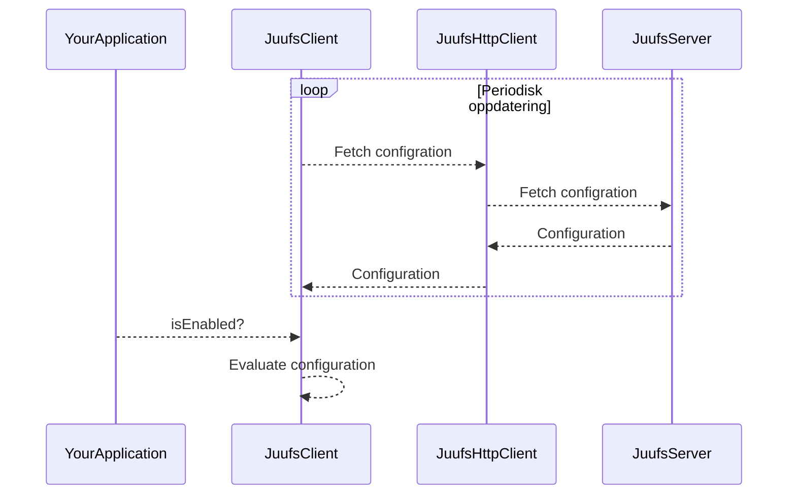

# juuffs - Just Use Unleash FFS

Simple setup to get something akin to unleash.

## Modules and apps
Consists of one app, and two modules:

### JuufsServer (`apps/app`)
The server hosting the featuretoggle configuration. At this time it only supports static configuration,
and would need a redeployment in order to update its configuration.

### Client (`libs/client`)
Client library to fetch and evaluate featuretoggle configurations.

It uses `ktor-client` with a default `CIO` engine, implementing the `JuuffsHttpClient.kt` interface.
And provides a standard implementation of `JuuffsClient.kt` which has a background task for fetching configuration, and exposes methods for evaluating toggles given a `Context`.

### Utils (`libs/utils`)
Utility library containing the shared domain model which is used by the backend app, and client.

## Building it
* Run `./gradlew build` to only build the application.
* Run `./gradlew check` to run all checks, including tests.
* Run `./gradlew clean` to clean all build outputs.

Note the usage of the Gradle Wrapper (`./gradlew`).
This project uses a version catalog (see `gradle/libs.versions.toml`) to declare and version dependencies
and both a build cache and a configuration cache (see `gradle.properties`).
